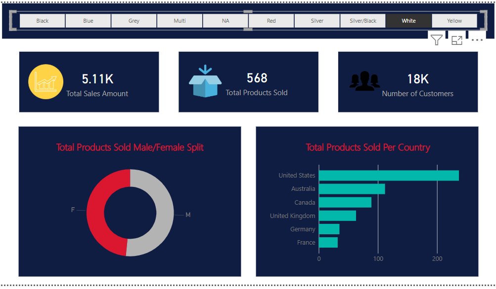

# Power BI Product Sales Dashboard 📊

## 🔹 Overview
This Power BI dashboard provides insights into **product sales, customer demographics, and regional distribution**. The report is visually designed with a professional layout.

## 📌 Features
- Slicer: Color filter for product selection.
- KPI Cards: Displaying total sales, customers, and products sold.
- Donut Chart: Split of products sold by gender.
- Bar Chart: Total products sold by country.
- Aesthetic Design: Custom header, color scheme, aligned images, and font settings.

## 📂 Files Included
- `Task Five.pbix` → Power BI file with complete visuals.
- `Section Five Data Extract.xlsx` → Sample dataset used.
- `images/` → Folder containing dashboard screenshots.


## 🛠️ DAX Measures Used
```DAX
Products Sold = COUNT(dim_Product[ProductID])
Total Customers = DISTINCTCOUNT(dim_Customer[CustomerID])
Total Sales Amount = SUM(fact_Sales[SalesAmount])

## 📊 Dashboard Overview


